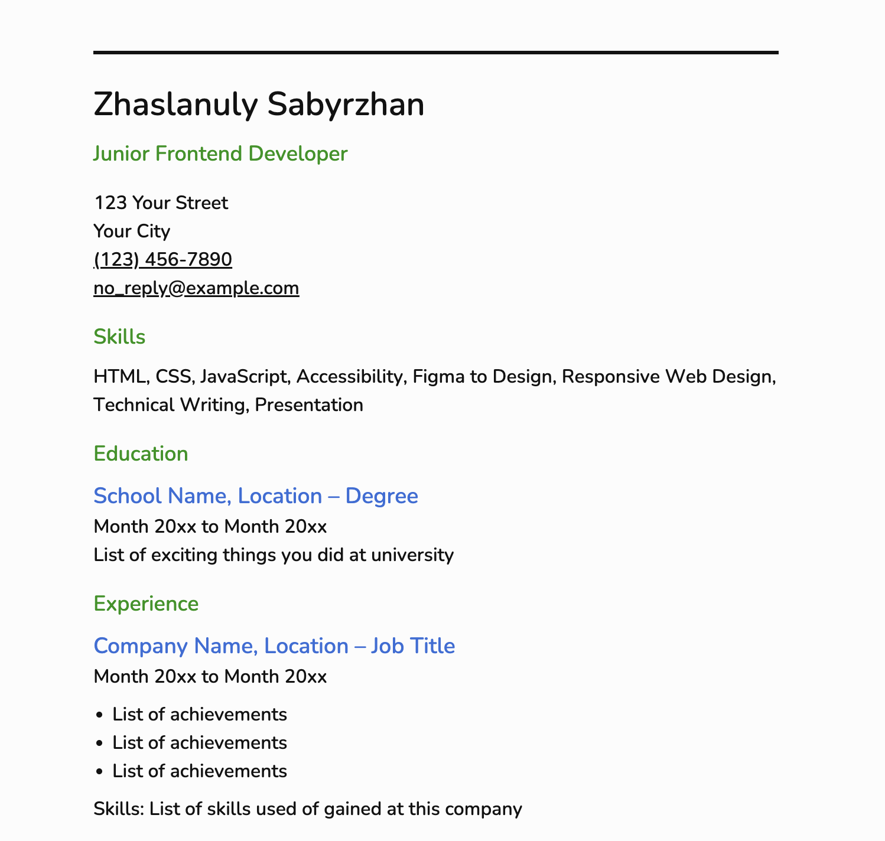

# Single Page CV


[](https://sabyrkazan.github.io/single-page-cv/)

A simple single-page CV built with semantic HTML.

This project is part of the Frontend Developer roadmap from roadmap.sh.

## Preview



## Features

* Semantic HTML structure
* SEO meta tags
* Open Graph tags
* SVG favicon
* Accessible markup
* Single-page layout

## Tech Stack

* HTML5
* CSS3

## Project Structure

```
├── index.html
│
├── README.md
├── .gitignore
│
├── preview.png
├── favicon/
│   └── favicon.svg
│
└── styles/
    ├── base/
    ├── layout/
    └── main.css
```

## Project Source

https://roadmap.sh/projects/single-page-cv

## Author

GitHub: https://github.com/sabyrkazan <br />
Telegram: https://t.me/sabyrkazan
